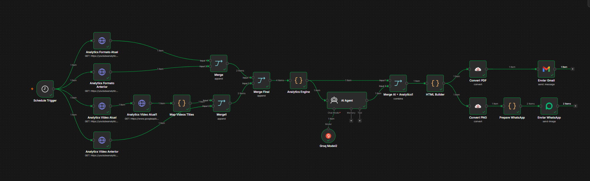
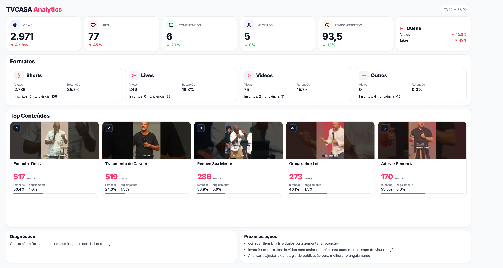

# 🚀 YouTube Analytics Automation

Sistema completo de análise automatizada para canais do YouTube utilizando **n8n + IA + YouTube Analytics API + HTML Reports + WhatsApp + Gmail**.

O projeto coleta métricas automaticamente, compara o desempenho semanal, gera insights com IA, cria dashboards visuais em HTML/PDF/PNG e envia tudo automaticamente via WhatsApp e e-mail, sem nenhuma intervenção manual.

---

## ✨ Visão Geral

Este workflow foi desenvolvido para transformar dados brutos do YouTube em relatórios executivos automáticos. O fluxo de orquestração executa as seguintes tarefas:

- Coleta dados do YouTube Analytics
- Compara semana atual vs anterior
- Calcula KPIs automaticamente
- Analisa formatos de conteúdo
- Identifica top vídeos
- Usa IA para gerar diagnóstico
- Cria dashboard visual premium
- Exporta PDF e PNG
- Envia automaticamente via WhatsApp e Gmail

---

## 🧠 Stack Utilizada

| Tecnologia | Função |
|---|---|
| **n8n** | Orquestração do workflow |
| **YouTube Analytics API** | Coleta de métricas |
| **YouTube Data API** | Busca títulos dos vídeos |
| **Groq + Llama 3.3 70B** | Inteligência artificial |
| **HTML/CSS** | Renderização do dashboard |
| **CloudConvert** | Conversão HTML → PDF/PNG |
| **Evolution API** | Envio no WhatsApp |
| **Gmail API** | Envio por e-mail |

---

## 🔥 Funcionalidades

### 📊 KPIs Automáticos
O sistema calcula automaticamente o crescimento e a queda percentual das seguintes métricas:
* Views
* Likes
* Comentários
* Inscritos ganhos
* Tempo assistido

### 🎯 Análise de Formatos
Analisa performance por tipo de conteúdo (Shorts, Lives, Vídeos longos, Outros formatos) extraindo métricas de:
* Retenção
* Eficiência
* Engajamento
* Inscritos gerados

### 🧠 Insights com IA
A inteligência artificial analisa os dados crus e atua estrategicamente para:
* Detectar crescimento ou identificar quedas
* Analisar retenção e comparar formatos
* Gerar diagnóstico executivo
* Sugerir próximas ações em linguagem estratégica

### 🖼 Dashboard Premium e Distribuição
O sistema gera um dashboard HTML responsivo (estilo SaaS Analytics), que é convertido em PDF executivo e PNG, distribuindo os arquivos de forma 100% automatizada para grupos/contatos no WhatsApp e caixas de entrada no Gmail.



---

## 🏗 Arquitetura do Workflow

**Fluxo de Execução:**
`Schedule Trigger` → `YouTube API` → `Merge Dados` → `Analytics Engine` → `AI Agent` → `HTML Builder` → `PDF + PNG (CloudConvert)` → `WhatsApp + Gmail`

### Como Funciona Passo a Passo

1. **Coleta de Dados:** O workflow consulta a semana atual e a anterior usando a YouTube Analytics API e a YouTube Data API.
2. **Processamento:** O Analytics Engine soma métricas, calcula deltas, identifica os top vídeos, mede retenção e calcula score de eficiência.
3. **Inteligência Artificial:** O AI Agent recebe o JSON de dados e responde com um diagnóstico focado no formato e um plano de ação para a próxima semana.
4. **Dashboard HTML:** O HTML Builder monta o visual, cria cards, rankings e grids responsivos com design premium (Light Mode, foco em leitura rápida).
5. **Conversão:** O CloudConvert transforma o payload HTML em relatórios estáticos (PDF e PNG).
6. **Distribuição:** O relatório é disparado pelos nós do Gmail e da Evolution API (WhatsApp).

---

## Imagem Dashboard



--

## ⚡ Diferenciais

* ✅ 100% automatizado e Escalável
* ✅ Insights executivos gerados por IA
* ✅ Comparação semanal nativa
* ✅ Dashboard de nível profissional (SaaS Analytics)
* ✅ Fácil adaptação e customização

---

## 📁 Estrutura Recomendada

```text
📦 youtube-analytics-automation
 ┣ 📂 assets
 ┃ ┣ workflow.png
 ┃ ┗ dashboard.png
 ┣ 📄 README.md
 ┣ 📄 workflow.json
